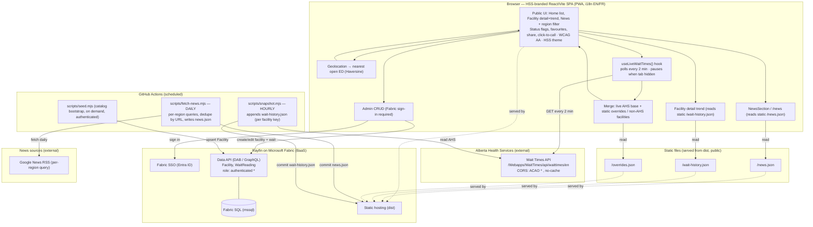

# HSS ED Wait Times — Architecture

> Living document. Update this diagram whenever the architecture changes
> (a new data flow, source, entity, service, or refresh cadence).

## Access model (hybrid)

The patient-facing app is **100% public with zero backend dependency**: live wait times
are fetched in-browser from AHS, and news + trend history are served as **static JSON**
files regenerated by scheduled GitHub Actions. Only the **staff admin CRUD** is gated
behind Fabric sign-in and uses the Rayfin Data API (`@authenticated`).

> Why: Rayfin on Microsoft Fabric **rejects the anonymous data role at deploy time**
> (`db apply` fails). Anonymous data access is preview-only and not deployable, so public
> data cannot come from the Data API. Public data is therefore static JSON; all DB writes
> require authentication.

## AHS regions (all seven)

AHS API key → display name:
`Calgary→Calgary`, `Edmonton→Edmonton`, `RedDeer→Red Deer`,
`Lethbridge→Lethbridge`, `MedicineHat→Medicine Hat`,
`GrandePrairie→Grande Prairie`, `FortMcMurray→Fort McMurray`.

## System diagram

## Data flow summary

- **Wait times (live, every 2 min):** Browser fetches the AHS Wait Times API directly
  (CORS-enabled), with no backend involved. Static `overrides.json` (admin corrections /
  non-AHS facilities) is merged on top.
- **News (daily, static):** GitHub Actions runs `fetch-news.mjs` against Google News RSS
  per region, writes `public/news.json`, and commits it. The browser reads the static file.
- **Trends (hourly, static):** GitHub Actions runs `snapshot.mjs`, appends a point per
  facility `key` to `public/wait-history.json` (capped), and commits it. The facility
  detail page reads the static file for sparklines.
- **Admin CRUD (authenticated):** Staff sign in via Fabric SSO; the admin pages talk to
  the Rayfin Data API (`Facility`, `WaitReading`, `authenticated` role). This is the only
  path that touches the backend.
- **Hosting:** the SPA and the static JSON files are served from Rayfin static hosting on
  Microsoft Fabric.
